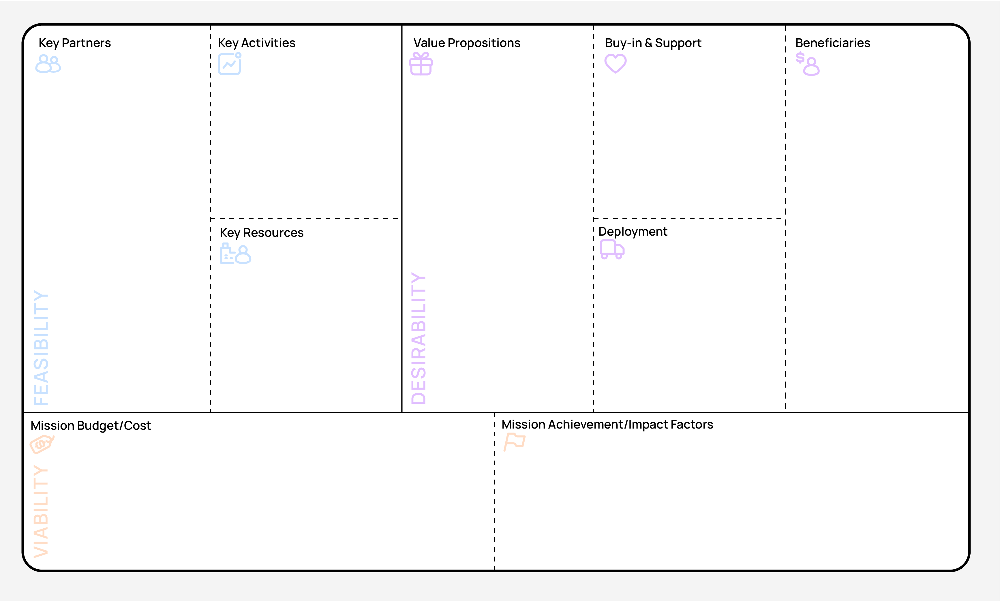

# Mission Model Canvas

> Status: Draft

  

## 2.1 Beneficiaries

*Who benefits from this community?*

**Primary beneficiaries (must-serve from Day 1):**

1. Companies and working engineers in the Ottawa/Kanata tech ecosystem (who want to learn, network, and use RISC-V)
2. Researchers in adjacent fields (architecture, AI accelerators, security, HPC, embedded systems)
3. Post-secondary students in Ottawa

**Secondary beneficiaries (Year 2+):**

1. Hobbyist and self-taught technologists (FPGA tinkerers, DIY makers, FOSSi enthusiasts)
2. K–12 teachers and students (providing digital-literacy)

**Beneficiaries we explicitly will NOT serve (helps avoid scope creep):**

1. Pure job seekers expecting placement or staffing services. We facilitate networking and skills, we are not a recruiting agency.
2. General web/app/data audiences with no interest in hardware, systems, or silicon. There are other Ottawa groups for them.
3. Companies looking for a pay-to-pitch sales platform. Sponsors are welcome, but the meetup floor is not a vendor booth.
4. Buzzword speculation crowds (crypto/blockchain hype) using RISC-V as a marketing hook with no technical engagement.

## 2.2 Value proposition (per beneficiary segment)

*What does each segment get from us that they can't get elsewhere?*

**Working engineers and researchers**
* What they get: Practical sessions on tools (Verilator, cocotb, Yosys, RTOS, Renode) and hardware (FPGAs, MCUs, OpenHW cores), career/research relevant networking, exposure to the open standard
- Why they can't get this elsewhere in Ottawa: Employer training or courses might not cover RISC-V or the amazing tools and projects from the open source community; global conferences are expensive and not local; no local peer group

**Post-secondary students**
* What they get: Free hands-on RISC-V training, chance to volunteer and learn (good for resume), peer network
- Why they can't get this elsewhere in Ottawa: No equivalent local community; university courses are theoretical or don't teach RISC-V; co-op postings rarely teach RISC-V specifically (but it may become more relevant as time goes, making this useful for them)

**Sponsors**
* What they get: Recruiting pipeline, brand association with our open-source community, RISC-V ecosystem signal in Canada
- Why they can't get this elsewhere in Ottawa: The only RISC-V-specific grassroots community in Ottawa, comprised of working professionals, researchers, and students

## 2.3 Buy-in & support

*Who do we need to sustain us, and what kind of relationship do we need with them?*

**RISC-V International**

* What we get: community group affiliation, ambassador status for a founding member, listing in global meetup network
* What they get in return: a Canadian capital-region presence; adoption data; ambassador content

**Eclipse/OpenHW Foundation**

* What we get: mentorship, guest speakers, project ideas and support, possibly operational support
* What they get in return: local talent and potential contributors to their projects; increased awareness of their foundations; connections from within our group and academic ties

**Carleton / uOttawa / Algonquin**

* What we get: faculty partnerships, room bookings, a place to promote our projects and work
* What they get in return: content (free) for their students; visible community impact

**Sponsors**

* What we get: cash and in-kind support (venue, food, hardware, swag), partnership/affiliation, occasional speaker access
* What they get in return: logo placement on the site, event slides, and recurring meetup mentions; early access to a vetted talent pool; speaking and demo slots tied to RISC-V topics; association with a credible, neutral, founding community in the region; and goodwill from visibly backing open hardware locally. Support does not buy editorial control, neutrality on tooling/vendors, or a captive sales channel.

## 2.4 Deployment

*How do people find us and how do we reach them?*

**Inbound channels (how they find us):**

* Website: [riscvottawa.ca](http://riscvottawa.ca)
* GitHub: [riscv-ottawa](https://github.com/riscv-ottawa)
* Discord: [RISC-V Ottawa](https://discord.gg/EfryE4wfk4)
* LinkedIn page: [RISC-V Ottawa](https://www.linkedin.com/company/riscv-ottawa)
* Luma page: [RISC-V Ottawa](https://luma.com/riscv-ottawa)
* RISC-V International Community Groups page: TBD
* Word of mouth from university faculty
* Kanata North BIA newsletter and Hub350 event channels
* University CS/EE department mailing lists and student society channels (IEEE student branches, ECE societies)
* Cross-listing on adjacent local tech communities (Ottawa hardware/embedded/FPGA groups, maker spaces)
* Presence at local hackathons, career fairs, and conferences

**Outbound channels (how we reach them):**

* Social posts (where: LinkedIn)
* University shout-outs
* Cross-posting to adjacent groups (Works with RISC-V, IEEE, OpenHW, Eclipse Foundation, etc)
* Email newsletter (platform: TBD, candidates: Buttondown, Mailchimp free tier, or Luma's built-in event emails)
* Direct outreach to professors, lab leads, and company tech leads for talks and attendance
* Guest lectures and table presence at university events and local hackathons

## 2.5 Key activities

*What do we actually DO? List the top 5–7 ongoing activities.*

1. Monthly public meetup (stable schedule, standard rituals)
   * Ideas: invite guest speakers, status update, lightning talks, cover recent cool projects
2. Quarterly hands-on training/workshop
3. Curated resources maintenance ([riscvottawa.ca/resources](https://riscvottawa.ca/resources))
4. Annual community gathering / unconference
5. Online community engagement (Discord Q&A and async help, sharing RISC-V news and project links, lowering the barrier for newcomers between meetups)
6. Partnerships and outreach (guest lectures, representation at university events and conferences, cross-promotion with affiliated foundations)
7. A rolling community open-source project track (a shared, beginner-friendly RISC-V project members can contribute to between events)

## 2.6 Key resources

*What do we need to deliver these activities?*

For each resource type, note what we need and whether we have it, need it, or have a gap.

**People (skills)**

* Have: founding core team
* Need: more instructors/leaders so we aren't reliant on one or two people (and can cover more topics, such as design, verification, RTOS, etc), a treasurer/admin
* Gap: a succession leader (avoid single points of failure) and dedicated treasurer/admin (future need)

**Space**

* Have: options from rooms via partners (Eclipse office, university rooms)
* Need: a confirmed recurring meetup place so things are stable/consistent (that has screen, wifi, power outlets, room for 30-60 people)
* Gap: dedicated lab/storage space for shared hardware

**Hardware (infra, dev boards, FPGAs, test gear)**

* Have: personal boards members can bring
* Need: a shared, tracked loaner pool of RISC-V dev boards (ESP32-C3/C6, Milk-V, etc), FPGAs, and adapters (debug/serial) for workshops; dedicated server infrastructure for hosting content and providing shared RISC-V compute
* Gap: dedicated servers, purchase budget, storage, and some basic form of asset-tracking

**Software / tooling**

* Have: open-source FTW (Linux, GCC/LLVM, Verilator, Yosys, cocotb, Rennode, OpenOCD, GTKWave/Surfer, etc)!
* Need: maybe some paid tooling licenses (Vivado, etc)?
* Gap: None

**Money**

* Have: empty pockets
* Need: would be nice to have some funding for event food, hardware, etc; sponsors; small grants
* Gap: funding (ideally repeatable)

**Legal / admin**

* Have: nothing
* Need: a code of conduct; a decision on legal form (unincorporated association vs. nonprofit); bank account and bookkeeping
* Gap: review of different incorporation options (if needed)

## 2.7 Key partners

*Distinct from "support". These are operational partners we co-deliver with.*

**OpenHW Foundation**

* What we co-deliver: hands-on workshops, lightning sessions on CORE-V cores and  the OpenHW tooling, the design and tapeout of a real freaking MCU!?
* What we contribute: a local pool of contributors and testers, real-world feedback on their cores and docs, and a venue to surface their projects
* What they contribute: guest speakers, curriculum and project ideas, mentorship for contributors, and swag/recognition for participants

**Eclipse Foundation**

* What we co-deliver: working sessions and hackathons around relevant Eclipse projects (ThreadX, embedded tooling, IoT/edge)
* What we contribute: a potential contributor pipeline and project visibility for ThreadX
* What they contribute: project guidance, infrastructure?, and connections into their broader ecosystem

**uOttawa and Carleton**

* What we co-deliver: student-facing workshops, relevant guest lectures, and capstone/project topics drawn from real RISC-V work
* What we contribute: industry mentors, practical topics, and a bridge from coursework to the working ecosystem
* What they contribute: rooms, a student audience, faculty expertise, lab and tool access

## 2.8 Cost structure

*Rough monthly and annual costs.*

For each category, record rough monthly cost, annual cost, and any notes.

**Venue / space rental**
- Monthly: $0
- Annual: $0
- Notes: assumes in-kind hosting (Eclipse / university rooms). Budget ~$150-200/event if we ever need to rent.

**Domain, hosting, comms tools**
- Monthly: ~$0-20
- Annual: ~$20-100
- Notes: Domain (~$20/yr), static-site hosting (free, currently self-hosted), Discord free.

**Luma**
- Monthly: $0
- Annual: $0
- Notes: Free tier covers our event cadence.

**OPTIONAL: event supplies (food, prints)**
- Monthly: ~$200
- Annual: ~$2,400
- Notes: Would be nice to eventually get pizza/coffee for everyone at our monthly meetups, plus name tags and signage.

**OPTIONAL: hardware purchases / replenishment**
- Monthly: ~$100
- Annual: ~$1,200
- Notes: Amortized loaner-pool buildout and replacement. Front-loaded; can be offset by in-kind donations.

**Legal (incorporation, bylaws review)**
- Monthly: ?
- Annual: ?
- Notes: Mostly one-time in Year 1. ~$0 if we stay an unincorporated association; $?? to incorporate as a nonprofit.

**Accounting / bookkeeping**
- Monthly: ~$0
- Annual: ~$0
- Notes: DIY at this scale; can review approaches later.

**Workshops (instructor honoraria, materials)**
- Monthly: ?
- Annual: ?
- Notes: TBD

**Contingency (10–15%)**
- Monthly: ~$??
- Annual: ~$??
- Notes: ~15% buffer for overruns and surprises.

**TOTAL**
- Monthly: TBD
- Annual: TBD

## 2.9 Mission achievement / impact factors

*How do we measure that we're succeeding at our mission? Not money, but impact.*

**Active community members**
- How we'll measure it: Discord active + meetup RSVPs
- Year 1 target: ~75 members/RSVP pools, with an average of 30 to 40 actually active members

**Workshops delivered**
- How we'll measure it: # workshops × # attendees
- Year 1 target: 2-4 workshops reaching 60+ unique participants

**Open-source contributions (PRs, projects)**
- How we'll measure it: GitHub org metrics
- Year 1 target: people merging PRs actively and 1-2 community projects completed

**Diversity of participation**
- How we'll measure it: Demographic survey (opt-in)
- Year 1 target: establish a baseline in Year 1; aim for 30%+ student participation and meaningful representation of underrepresented groups

**Retention / repeat attendance**
- How we'll measure it: share of attendees who return to a second event (RSVP/check-in data)
- Year 1 target: 40%+ of attendees come back for at least one more event
