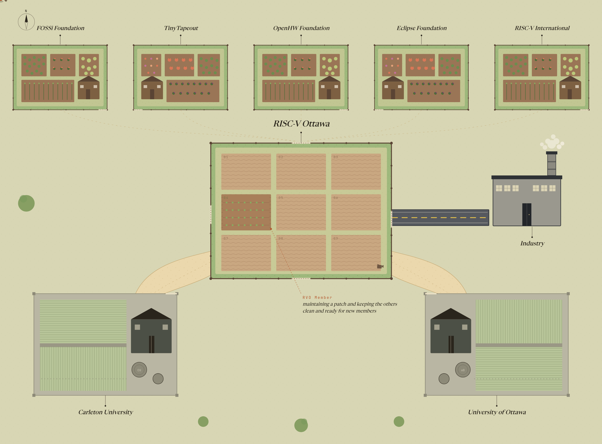

# RISC-V Ottawa community planning worksheet

This repository holds the planning and governance worksheet for **RISC-V Ottawa (RVO)**, a community of engineers, researchers, and students in Canada's capital region learning, building, and contributing across the full RISC-V stack.

The worksheet is a living document: it captures who we serve, how we operate, how we govern ourselves, and what we plan to do in our first year.

  

## How to use this

Each document below is one reviewable section.
Read top to bottom for the full picture, or jump to the section your group is working on. Sections still being filled in are marked 🚧.

| # | Document | What it covers | Status |
| :-- | :-- | :-- | :-- |
| 1 | [Foundations](01-foundations.md) | Why we exist, our three orientations, and the founding-team check | Draft |
| 2 | [Mission Model Canvas](02-mission-model-canvas.md) | Beneficiaries, value propositions, partners, costs, and impact measures | Draft |
| 3 | [Community Canvas — Identity](03-community-identity.md) | Who the community is for, what success looks like, our values and brand | Draft |
| 4 | [Community Canvas — Experience](04-community-experience.md) | Member journey, rituals, content, roles, and rules | 🚧 In progress |
| 5 | [Structure & Governance](05-structure-and-governance.md) | Legal structure, governance model, financing, controls, and transparency | 🚧 In progress |
| 6 | [First 12 Months Operational Plan](06-operational-plan.md) | Quarter-by-quarter milestones and the risks register | 🚧 In progress |
| 7 | [Logs](07-logs.md) | Pre-launch decision log and the open-questions parking lot | 🚧 In progress |
| 8 | [Appendices](08-appendices.md) | Reading list and templates to import / adapt | Reference |

## How this is organized

Files are numbered `01`–`08` in reading order, one per major section, and live at the repository root. Sub-points keep the numbering used inside each file (e.g. governance section 5.2 lives in `05-structure-and-governance.md`). Cross-references between files are relative links, so they keep working as the documents move.

Status legend used in the table above and in each file's header:

- **Draft** — content is in place, open for review and refinement.
- **🚧 In progress** — has placeholders or TBDs that still need filling in.
- **Reference** — stable supporting material, not expected to change often.

The worksheet is a living document and contributions are welcome. See [CONTRIBUTING.md](CONTRIBUTING.md) for how to edit a section, add a new one, and keep statuses and cross-references in sync.

## Get involved

* Website: [riscvottawa.ca](https://riscvottawa.ca)
* Discord: [RISC-V Ottawa](https://discord.gg/EfryE4wfk4) ([QR code](./assets/discord-qr.svg))
* GitHub: [riscv-ottawa](https://github.com/riscv-ottawa)
* LinkedIn: [RISC-V Ottawa](https://www.linkedin.com/company/riscv-ottawa)
* Luma: [RISC-V Ottawa](https://luma.com/riscv-ottawa)
